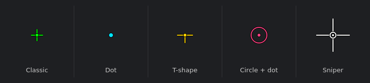

# crosshair-overlay

A lightweight, cross-platform crosshair overlay you can float on top of any game or program. The reticle is drawn as vector graphics, so it stays razor sharp at any size and ships with no image assets. Clicks and keystrokes pass straight through to whatever is underneath.

[](https://github.com/Cobos-Bioinfo/crosshair-overlay/actions/workflows/ci.yml)
[](https://www.python.org/)
[](https://doc.qt.io/qtforpython/)
[](https://github.com/astral-sh/uv)
[](https://github.com/astral-sh/ruff)
[](LICENSE)
[](#platform-notes)



## Why this one

Most crosshair snippets are a single file that slaps a PNG on the screen and calls it a day. This one keeps the small footprint but adds the parts that make it actually usable day to day:

- **Vector rendering.** Arms, center dot and circle are drawn with `QPainter`, so the crosshair is crisp at any scale and needs zero image files.
- **Composable, not fixed styles.** Toggle the arms, dot and circle independently to build classic, dot, T-shape, circle or hybrid reticles, then tune length, thickness, gap, color, opacity and outline.
- **True click-through.** Uses Qt's `WindowTransparentForInput`, so input passes through on Linux, Windows and macOS with no platform-specific code.
- **Live settings and a tray icon.** Adjust everything from a small GUI and watch the overlay update instantly. Settings persist to a JSON config.
- **Lightweight dependency.** A single runtime dependency, `PySide6-Essentials`, which leaves out the heavy Qt modules (WebEngine, 3D, and friends).
- **Tested and linted.** Offscreen render tests, config round-trip tests, `ruff`, and CI across Python 3.11 to 3.13.

## Requirements

- Python 3.9 or newer
- A desktop with a compositor (standard on Windows, macOS and modern Linux desktops). Transparency and always-on-top need one.

## Install and run

The quickest path uses [uv](https://github.com/astral-sh/uv), which handles the Python version and dependencies for you:

```bash
git clone https://github.com/Cobos-Bioinfo/crosshair-overlay.git
cd crosshair-overlay
uv run crosshair
```

To install the `crosshair` command onto your PATH:

```bash
uv tool install .
crosshair
```

Prefer plain pip? That works too:

```bash
pip install .
crosshair          # or: python -m crosshair_overlay
```

## Usage

Launch it and a green crosshair appears centered on your primary monitor, with an icon in the system tray.

- **Left-click the tray icon** to show or hide the crosshair.
- **Right-click the tray icon** for the menu: Settings, Reload config, and Quit.
- **Settings** opens a dialog where every property updates the overlay live and is saved automatically.

Command-line options:

```
crosshair [--config PATH] [--settings] [--no-tray] [--reset] [--version]

  --config PATH   Use a specific config file instead of the default location.
  --settings      Open the settings window on launch.
  --no-tray       Run without a tray icon (edit the config file to reconfigure).
  --reset         Write default settings to the config file and exit.
  --version       Print the version and exit.
```

If no system tray is available (common on WSL and minimal Linux desktops), the settings window opens automatically as the control surface, and closing it quits the app.

## Configuration

Settings are stored as JSON and can be edited by hand. The default location is:

| Platform | Path |
| --- | --- |
| Linux | `~/.config/crosshair-overlay/config.json` |
| macOS | `~/Library/Application Support/crosshair-overlay/config.json` |
| Windows | `%APPDATA%\crosshair-overlay\config.json` |

Every field:

| Field | Type | Meaning |
| --- | --- | --- |
| `show_lines` | bool | Draw the four cross arms. |
| `length` | int | Length of each arm in pixels. |
| `thickness` | int | Arm thickness in pixels. |
| `gap` | int | Empty gap between the center and each arm. |
| `t_shape` | bool | Hide the top arm for a T reticle. |
| `show_dot` | bool | Draw the center dot. |
| `dot_size` | int | Dot radius in pixels. |
| `show_circle` | bool | Draw a ring around the center. |
| `circle_radius` | int | Ring radius in pixels. |
| `circle_thickness` | int | Ring thickness in pixels. |
| `color` | string | Main color as a hex string, for example `#00FF00`. |
| `opacity` | int | Overall opacity from 0 to 100. |
| `outline` | bool | Draw a contrasting outline behind every element. |
| `outline_color` | string | Outline color as a hex string. |
| `outline_thickness` | int | Outline thickness in pixels. |
| `offset_x` | int | Horizontal nudge from center in pixels. |
| `offset_y` | int | Vertical nudge from center in pixels. |
| `monitor` | int | Screen index to center on (0 is primary). |

### Example presets

A minimal green dot:

```json
{ "show_lines": false, "show_dot": true, "dot_size": 3, "color": "#00E5FF" }
```

A cyan classic cross with a wider gap:

```json
{ "length": 10, "thickness": 2, "gap": 6, "show_dot": true, "color": "#00E5FF" }
```

The presets shown in the image above can be reproduced from `scripts/make_preview.py`.

## Platform notes

- The overlay stays on top of borderless and windowed games. **Exclusive fullscreen** mode can render past any overlay; this is a limitation shared by all external crosshairs. Set the game to borderless or windowed fullscreen if the crosshair disappears.
- On Linux, a running compositor is required for transparency. Most modern desktops (GNOME, KDE, and others) provide one by default.
- The system tray needs a tray host. If none is detected the app opens the settings window instead (close it to quit), so it stays usable.
- WSL2 (WSLg) has no tray and Wayland restricts always-on-top and absolute positioning, so the overlay cannot sit over native Windows games from inside WSL. Develop there if you like, but run it on Windows or an X11 desktop for actual use.

## Development

```bash
uv sync                              # create the environment
uv run ruff check .                  # lint
uv run pytest -q                     # run the test suite (headless, offscreen)
uv run python scripts/make_preview.py  # regenerate docs/preview.png
```

Tests run against Qt's offscreen platform, so they need no display and run fine in CI.

## Credits

Inspired by [georgegach/crosshair](https://github.com/georgegach/crosshair), rebuilt around vector rendering, a composable style model, cross-platform click-through, and a live settings GUI.

## License

[MIT](LICENSE)
